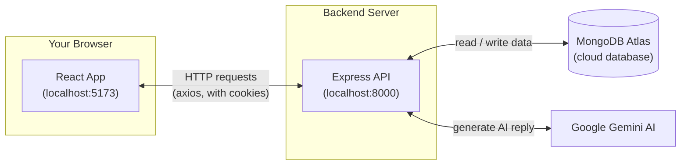
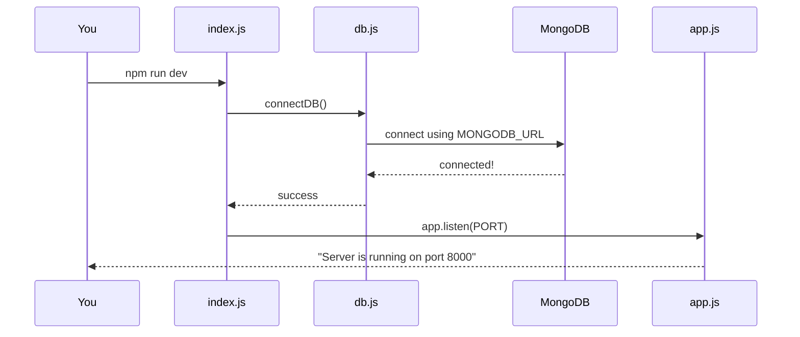
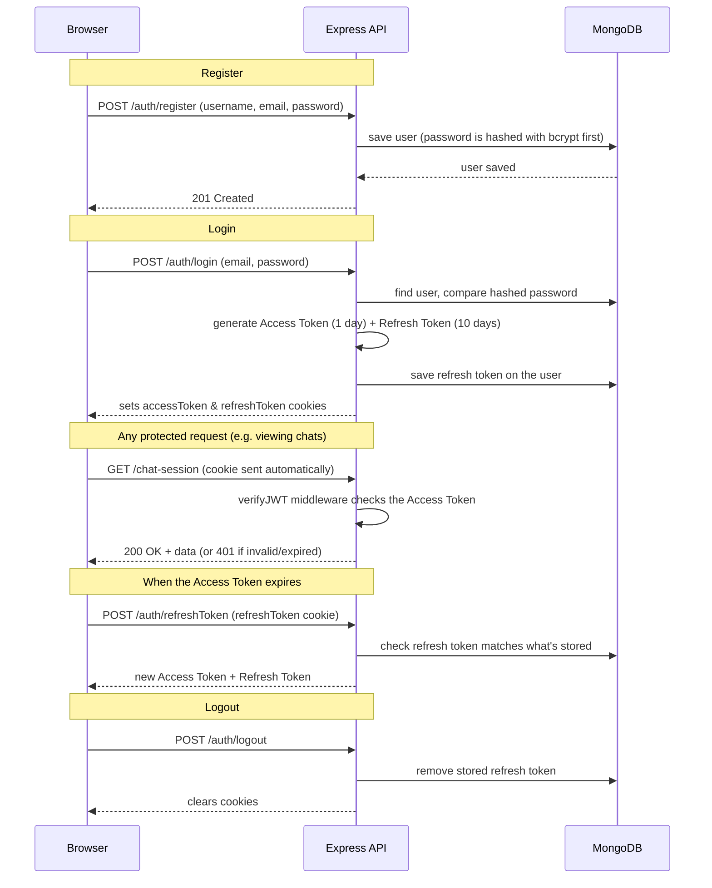
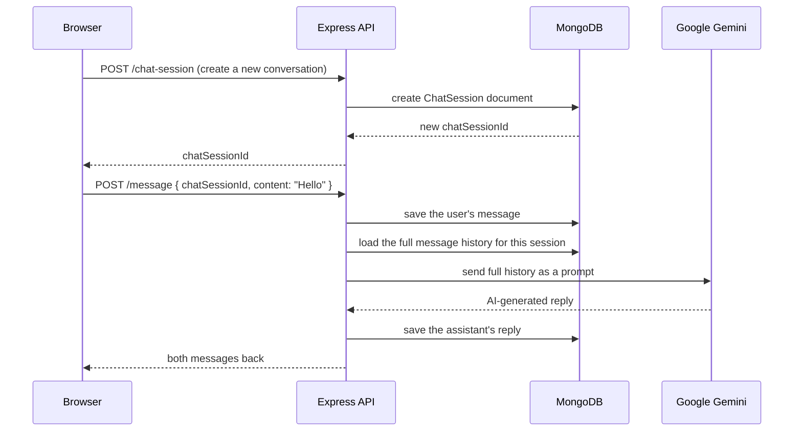
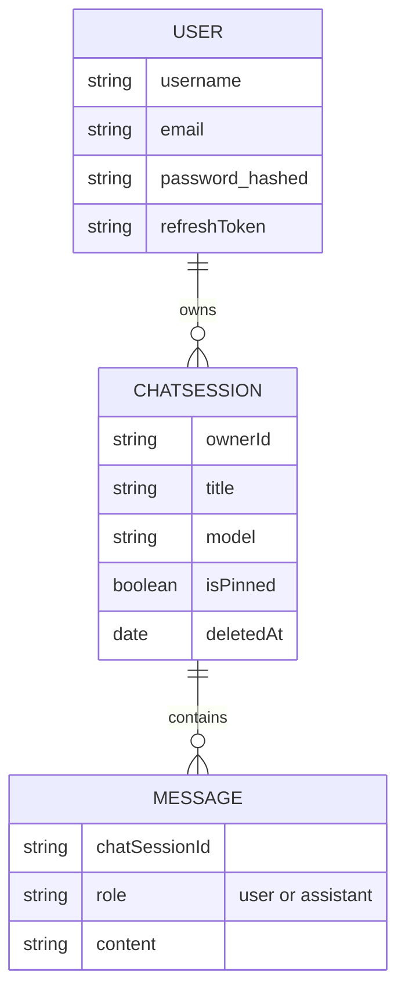
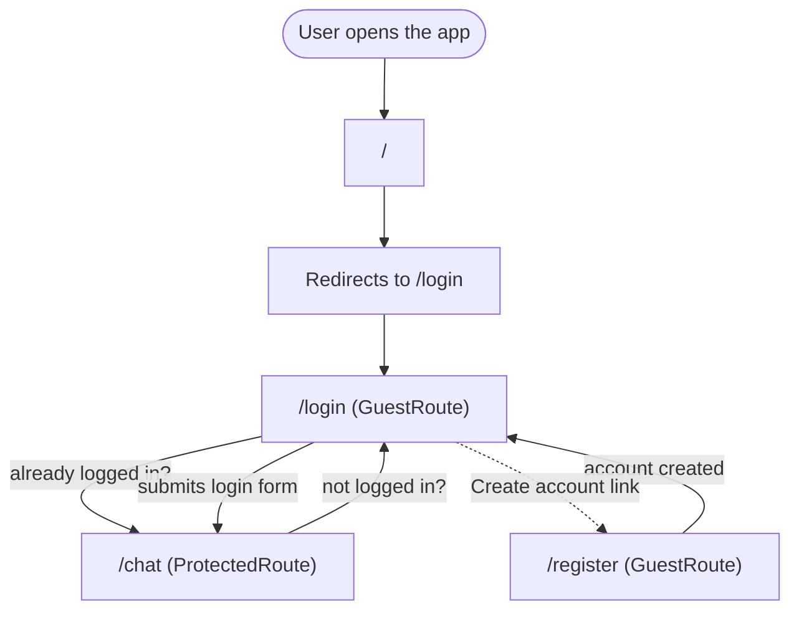
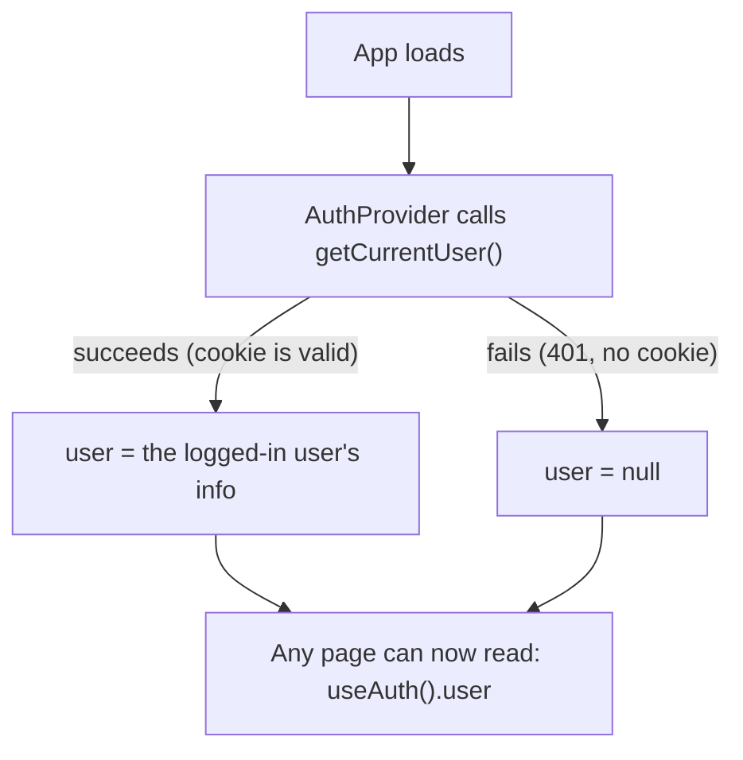
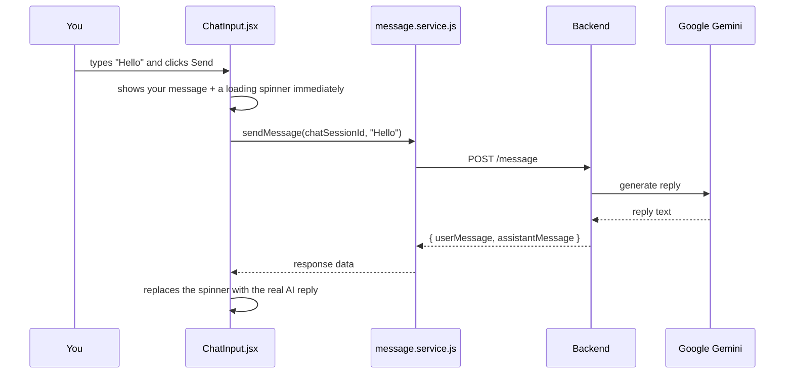

# Chatbot Project — Complete Workflow

> **Last updated:** 2026-07-21
> This is a **living document**. Every time we add or change a feature, we add a new dated entry to the [Changelog](#10-changelog) section at the bottom and update the relevant diagram/section above it. Don't delete old changelog entries — they're the project's history.

---

## 1. What This Project Is

A simple web app where a logged-in user can chat with an AI (Google Gemini). Think of it like a mini version of ChatGPT:

1. You create an account and log in.
2. You type a message.
3. The message is saved, sent to Google's Gemini AI, and the AI's reply is saved and shown back to you.
4. Next time you open the app, your past conversation is still there — it's saved in a real database, not just your browser.

---

## 2. Tech Stack (the tools we're using and why)

| Layer | Tool | Why |
|---|---|---|
| Frontend (what you see in the browser) | **React 19** | Lets us build the UI out of reusable pieces ("components") |
| Frontend build tool | **Vite** | Runs a fast local dev server and bundles the app for production |
| Frontend routing | **React Router** | Lets the app switch between pages (`/login`, `/register`, `/chat`) without reloading the browser |
| Frontend → Backend calls | **Axios** | A tool to make HTTP requests (like "send this message to the server") |
| Backend (the server) | **Node.js + Express 5** | Runs our JavaScript code as a web server that listens for requests |
| Database | **MongoDB Atlas** (cloud-hosted MongoDB) | Stores users, chat sessions, and messages permanently |
| Talking to the database | **Mongoose** | A helper library that makes it easy to read/write MongoDB from Node.js |
| Passwords | **bcrypt** | Scrambles ("hashes") passwords so even we can't read the real password from the database |
| Login sessions | **JWT (jsonwebtoken)** | A signed, tamper-proof "ticket" that proves who you are after logging in |
| AI replies | **Google Gemini API** (`gemini-2.5-flash`) | Generates the chatbot's responses |

---

## 3. The Big Picture — How Everything Connects



**In plain words:** your browser never talks to the database or to Gemini directly. It only ever talks to our own backend server, and the backend is the only thing that talks to MongoDB and Gemini. This keeps secrets (like the Gemini API key and database password) safely on the server, never exposed to the browser.

---

## 4. Backend — Step by Step

### 4.1 Folder structure (what lives where)

```
Backend/src/
├── index.js              # Entry point — starts everything
├── app.js                # Sets up Express, middleware, and routes
├── env.js                # Loads the .env file (secrets & config)
├── config/db.js          # Connects to MongoDB
├── models/                # "Shape" of our data (User, ChatSession, Message)
├── controllers/           # The actual logic for each API endpoint
├── routes/                 # Maps URLs (e.g. POST /auth/login) to controller functions
├── middlewares/verifyJWT.js  # Checks "is this person actually logged in?"
├── services/gemini.service.js  # Talks to Google Gemini
└── utils/                  # Small reusable helpers (error/response formatting)
```

### 4.2 What happens when you run `npm run dev`



If the MongoDB connection fails, the server refuses to start — this is intentional, so we never run with a broken database connection.

### 4.3 Authentication (Login System)

**Simple analogy:** logging in is like getting a wristband at a concert.
- **Access Token** = the wristband. It proves you're allowed in, but it expires after 1 day.
- **Refresh Token** = a backstage pass that lets you get a *new* wristband without showing ID again. It lasts 10 days.
- Both are stored as secure **cookies** in your browser — the browser sends them automatically with every request, so you don't have to log in on every page.



### 4.4 Chat Sessions & Messages

**Simple analogy:** a **Chat Session** is one conversation thread (like one chat in WhatsApp). Each session can have many **Messages** inside it, each tagged as either `"user"` (you) or `"assistant"` (the AI).



**Data model — what gets stored:**



Note: deleting a chat session doesn't actually erase it from the database — it just stamps a `deletedAt` date on it ("soft delete"), and all our queries skip anything with `deletedAt` set. This means recovery is possible later if ever needed.

---

## 5. Frontend — Step by Step

### 5.1 Folder structure

```
Frontend/src/
├── main.jsx                # Boots the React app
├── App.jsx                 # Defines all the page routes
├── context/
│   ├── auth-context.js     # The "who's logged in?" data + useAuth() hook
│   └── AuthContext.jsx      # The component that provides that data to the app
├── components/
│   ├── RouteGuards.jsx      # "Are you allowed to see this page?" logic
│   ├── ChatInput.jsx        # The text box + send/clear buttons
│   ├── Chatmessages.jsx     # The scrolling list of messages
│   ├── Chatmessage.jsx      # One single message bubble
│   └── AutoScroll.jsx       # Auto-scrolls to the newest message
├── pages/
│   ├── LoginPage.jsx
│   ├── RegisterPage.jsx
│   └── ChatPage.jsx
├── services/                # Functions that call the backend API (one file per topic)
│   ├── auth.service.js
│   ├── chatSession.service.js
│   └── message.service.js
└── Api/api.js               # The shared Axios setup (base URL + "send cookies" config)
```

### 5.2 Routing & Protected Pages



- **GuestRoute**: if you're already logged in and try to visit `/login` or `/register`, it bounces you straight to `/chat` instead.
- **ProtectedRoute**: if you're *not* logged in and try to visit `/chat` directly (e.g. by typing the URL), it bounces you to `/login`.

### 5.3 Global Login State — `AuthContext`

Instead of every page having to ask "am I logged in?" separately, one shared `AuthContext` holds the answer for the whole app:



Any component can call `useAuth()` to get `{ user, login, register, logout }` without passing props down manually through every layer.

### 5.4 Sending a Message — Full Journey



If there's no chat session yet (first message ever), `ChatInput.jsx` first calls `createChatSession()` behind the scenes to start one, then sends the message into it.

---

## 6. What's Working Right Now (Feature Checklist)

**Backend**
- [x] Register / Login / Logout
- [x] Access token + refresh token flow
- [x] Route protection via `verifyJWT` middleware
- [x] Create / list / get / rename / delete chat sessions
- [x] Send message → saved to DB → sent to Gemini → AI reply saved to DB
- [x] Get full message history for a chat session

**Frontend**
- [x] Register page (new)
- [x] Login page, fully wired to the API (was previously just `console.log`)
- [x] Protected routes (`/chat` requires login) and guest routes (`/login`, `/register` redirect away if already logged in)
- [x] Global logged-in-user state (`AuthContext`)
- [x] Logout button
- [x] Chat history loads from MongoDB on page load/reload (previously only saved in `localStorage`, which didn't survive across devices/browsers)
- [x] Sending messages and seeing the AI reply live

---

## 7. Known Gaps / Not Built Yet

These are things we've deliberately left out so far — not bugs, just not built:

- No sidebar to switch between multiple past conversations (currently the app just shows your single most recent chat session)
- "Remember me" checkbox on login exists visually but isn't wired to anything
- No automated test suite (everything has been tested manually + with a one-off Playwright script)
- Cookie `secure` flag is hardcoded to `false` — must be flipped to `true` before deploying over HTTPS
- No password reset ("Forgot password" link is a placeholder)
- No rate limiting on the API

---

## 8. How to Run This Project Locally

```bash
# 1. Backend
cd Backend
npm install
npm run dev        # starts on http://localhost:8000

# 2. Frontend (separate terminal)
cd Frontend
npm install
npm run dev         # starts on http://localhost:5173
```

The backend needs a `.env` file (not committed to git) with `MONGODB_URL`, `ACCESS_TOKEN_SECRET`, `REFRESH_TOKEN_SECRET`, `GEMINI_API_KEY`, etc. — see `Backend/.env` for the current values.

---

## 9. Bugs Found & Fixed So Far

| Date | Bug | Fix |
|---|---|---|
| 2026-07-20 | `refreshAccessToken` crashed with `ReferenceError: jwt is not defined` | Added missing `import jwt from "jsonwebtoken"` in `auth.controller.js` |
| 2026-07-20 | Refresh tokens never actually worked — always said "expired or used" even right after login | `userSchema` was missing the `refreshToken` field entirely, so MongoDB silently dropped it on save. Added the field to the schema. |
| 2026-07-21 | Frontend called `/auth/current-user`, but the backend route is `/auth/currentUser` | Fixed the path in `auth.service.js` |
| 2026-07-21 | `chatSession.service.js` imported from `../api/api` (lowercase), but the real folder is `Api/` (capital) — worked on Mac only by luck, would break on Linux | Fixed the import casing |

---

## 10. Changelog

Add a new entry here every time a feature is added or changed. Keep old entries — don't delete history.

### 2026-07-21 — Full Auth Flow + Backend-Loaded Chat History
- Built the Register page, wired up the Login page (was previously non-functional)
- Added `AuthContext`, `ProtectedRoute`, `GuestRoute`
- Chat history now loads from MongoDB instead of `localStorage`
- Added a Logout button
- Fixed 4 bugs (see section 9)
- Verified with an automated Playwright browser test (8/8 checks passed): register → login → chat → send message → AI reply → reload persists history → logout → protected route redirect

### 2026-07-20 — Initial Backend Verification
- Installed all backend and frontend dependencies on a new Mac
- Verified every API endpoint by hand (register, login, currentUser, chat-session CRUD, message send/get, refreshToken, logout)
- Fixed 2 backend bugs (see section 9)
